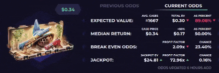
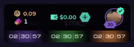
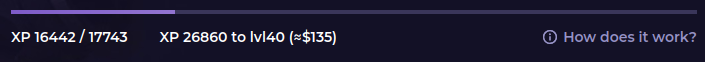
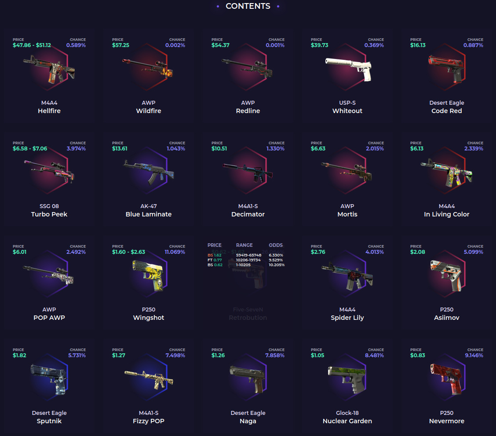
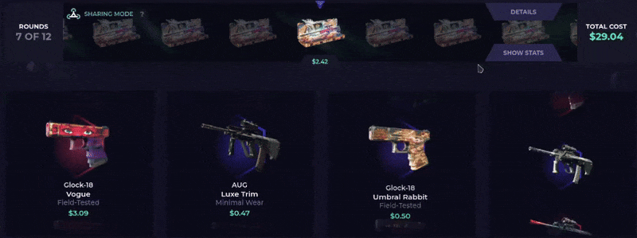
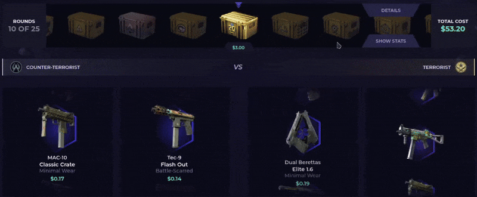
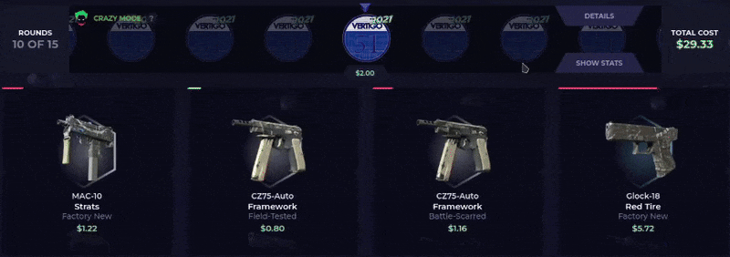

# OVERVIEW

# DISCLAIMER

# FEATURES
## Case Page Statistics
View advanced info about each case's odds, such as how risky the case is or how big the jackpot pays out.

## Sticky Giveaway Timers
Each giveaway case has it's timer appended underneath the sticky header, allowing you to see it on all pages.
You can also click the timers to be redirected to relevant giveaway case!

## Level Milestone Calculator
On your profile page you can see the number of XP required to hit the next daily case, as well as an approximate amount of USD you would need to spend to hit that milestone.

## Displayed Giveaway Odds
The prices and chances of each item in the giveaway cases are displayed on the skin list below the giveaway.

## Live Battle Tracker
Battles are tracked live allowing you to determine the winner before the battle has finished without having to add it up yourself.
For people who like the guessing game and seeing the big reveal at the end, the stats are hidden by default and must be enabled by pressing the "SHOW STATS" button!
### Sharing Mode Pool
For sharing mode battles a number displays the total value of all items pulled so far, as well as displaying the split each player will receive.
If you manage to hit positive, the red underline will change to green to show it immediately!

### Team Pool
For team battles you can see the total value of items per team so you can see which team is ahead.

### Crazy Mode Support
When crazy mode is enabled the colors are inverted, so the lowest valued battle slot shows as green as opposed to the highest.
This also applies to the team pools.

